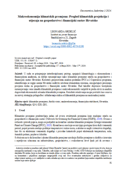
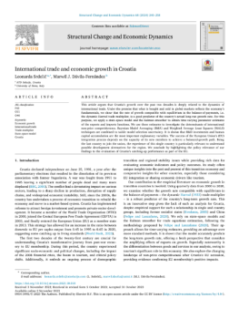

### **Climate Policy & Economic Systems**

  
  
<strong>European Trading System</strong>

  
  
<strong>Transition Risks of Climate Change</strong>

  
  
<strong>Macroeconomic Climate Analysis</strong>

---

### **Open Economies: Thirlwall's Law**

  
  
<strong>International Trade Growth</strong>

  
  
<strong>Croatian National Bank Study</strong>

