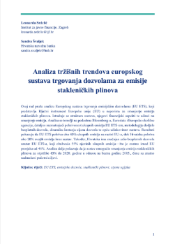
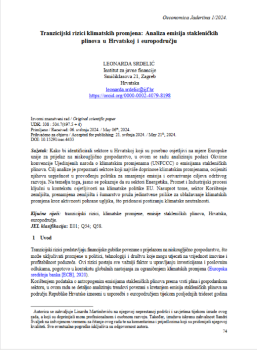

### **Climate Policy & Economic Systems**

|  |  |  |
|:-----------------------------------------------------------:|:----------------------------------------------------------------:|:----------------------------------------------------------------:|
| **European Trading System** | **Transition Risks of Climate Change** | **Macroeconomic Climate Analysis** |

---

### **Open economies: Thirlwall's law**

|  |  |
|:----------------------------------------------------------------------------------------------------------------------------:|:---------------------------------------------------------------------------------------------------------------------:|
| **International Trade Growth** | **Croatian National Bank Study** |
