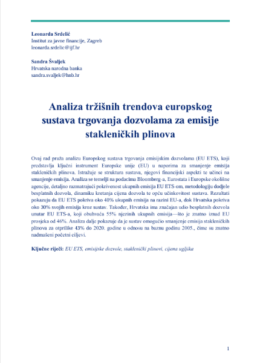
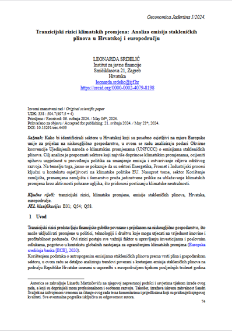
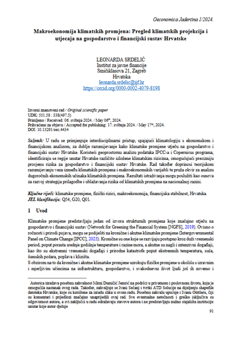
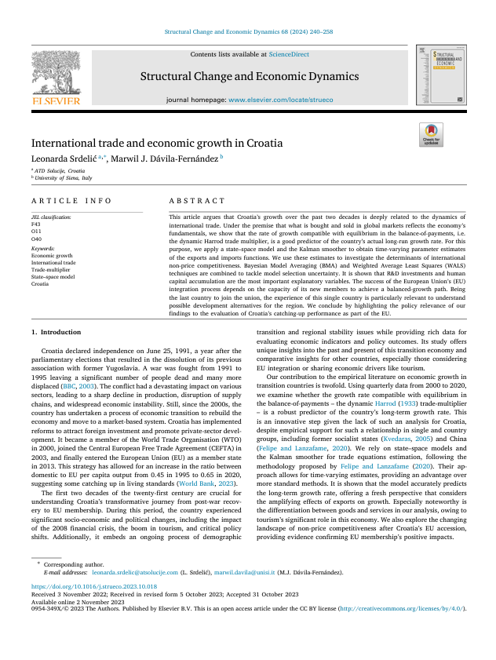
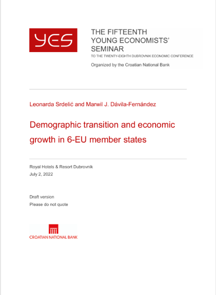

## **Featured Research**

  

    
    
European Trading System

  

  

    
    
Transition Risks of Climate Change

  

  

    
    
Macroeconomic Climate Analysis

  

---

## **Open Economies: Thirlwall's Law**

  

    
    
**International Trade Growth**

  

  

    
    
**Croatian National Bank Study**

  

